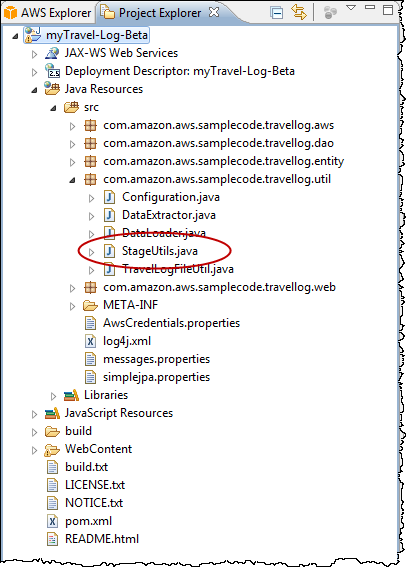

.. Copyright 2010-2016 Amazon.com, Inc. or its affiliates. All Rights Reserved.

   This work is licensed under a Creative Commons Attribution-NonCommercial-ShareAlike 4.0
   International License (the "License"). You may not use this file except in compliance with the
   License. A copy of the License is located at http://creativecommons.org/licenses/by-nc-sa/4.0/.

   This file is distributed on an "AS IS" BASIS, WITHOUT WARRANTIES OR CONDITIONS OF ANY KIND,
   either express or implied. See the License for the specific language governing permissions and
   limitations under the License.

#########################################
Differentiating AWS Resources with Naming
#########################################

During development of new products or features, it is useful to keep AWS resources that are used for
development separate from resources that are used for production. One approach to maintaining this
separation was discussed in the :doc:`setup-credentials`, that is, to use different accounts for
development and production resources. That approach works especially well when using AWS Explorer,
because AWS Explorer displays resources based on account credentials. This section will discuss an
alternative approach in which a naming convention is used to differentiate between development and
production resources |mdash| and in which support for the naming convention is implemented in code.

The basic idea is to distinguish your AWS resources, such as |S3long| (|S3|) buckets or |SDBlong|
domains, by adding a designated string value to the resource name. For example, instead of naming
your |SDBlong| domain "customers", you would name it "customers-dev" for development use or
"customer-prod" for production use. However, an issue arises if you need to move development code
into production. At that point, you would need to change all these strings, perhaps with a number of
global search and replace operations; that could be tedious or error prone. A more efficient method
would be to add support for the naming convention in the code.

The :code:`StageUtils` class exposes the following method.

.. code-block:: java

    public static String getResourceSuffixForCurrentStage()

The :code:`getResourceSuffixForCurrentStage` method returns a string that corresponds to the "stage"
in the software life cycle for which the resource is used, such as "dev" or "beta" or "prod". This
string can then be appended to resource identifiers used in code. You can use
:code:`getResourceSuffixForCurrentStage` to construct resource names. For example, the following
method, :code:`getTopicName`, returns a unique name for an Amazon SNS topic. Notice how it embeds
the return value from :code:`getResourceSuffixForCurrentStage` in this name.

.. code-block:: java

    private String getTopicName (Entry entry) {
        return "entry" + StageUtils.getResourceSuffixForCurrentStage() + "-" + entry.getId();
    }

The value returned by :code:`getResourceSuffixForCurrentStage` is retrieved from the Java system
property, "application.stage". You can specify this value by setting the system property in the
container configuration for |EBlong|.

.. note:: In the |tke|, your |EBlong| application needs to be up and running in order for you to
   access the container configuration. Changing and saving the configuration causes the application
   to automatically restart with the new configuration.

**To access the Container/JVM Options panel for your AWS Elastic Beanstalk application**

1.  In :guilabel:`AWS Explorer`, expand the :guilabel:`AWS Elastic Beanstalk` node and your
    application node.

2.  Beneath the application node, double-click your |EBlong| environment.

3.  At the bottom of the :guilabel:`Overview` pane, click the :guilabel:`Configuration` tab.

4.  In the :guilabel:`Container` area, configure the container options.

5.  In the :guilabel:`Additional Tomcat JVM command line options` box, specify the value for the
    application.stage system property by adding a :literal:`-D` command line option. For example,
    you could use the following syntax to specify that the string value should be "-beta".

    :userinput:`-Dapplication.stage=beta`

    Note that :code:`getResourceSuffixForCurrentStage` automatically prepends a hyphen character to
    whatever string value you specify.

    .. image:: images/tke-container-config.png
        :scale: 70

6.  After you have added the system property value, click the :guilabel:`File` menu, and then click
    :guilabel:`Save`. Eclipse will save the new configuration. The application should restart
    automatically. You can check the :guilabel:`Events` tab |mdash| at the bottom of the Eclipse
    editor |mdash| for the event that indicates that the new configuration was successfully deployed
    to the environment.

7.  After the application restarts, expand the :guilabel:`Amazon SimpleDB` node in :guilabel:`AWS
    Explorer`. You should now see a new set of domains that use the string value that you specified.

    .. image:: images/tke-domains-beta.png
        :scale: 50

.. note:: For more information about configuring the container, see :eb-dg:`Creating and Deploying
   Java Applications on AWS Elastic Beanstalk <create_deploy_Java>` in the |EB-dg|.

