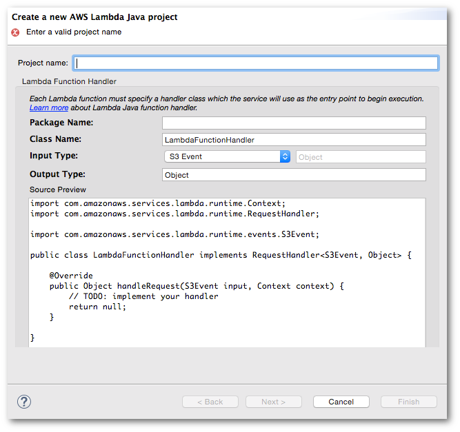

.. Copyright 2010-2016 Amazon.com, Inc. or its affiliates. All Rights Reserved.

   This work is licensed under a Creative Commons Attribution-NonCommercial-ShareAlike 4.0
   International License (the "License"). You may not use this file except in compliance with the
   License. A copy of the License is located at http://creativecommons.org/licenses/by-nc-sa/4.0/.

   This file is distributed on an "AS IS" BASIS, WITHOUT WARRANTIES OR CONDITIONS OF ANY KIND,
   either express or implied. See the License for the specific language governing permissions and
   limitations under the License.

#################################
New |LAMlong| Java Project Dialog
#################################

The :guilabel:`New Lambda Java Project` dialog helps you to create and configure a new Java project
that you can use to author a |LAM| function.

Launching the dialog
====================

The :guilabel:`New Lambda Java Project` dialog can be launched in the following ways:

* by opening the AWS menu in the Eclipse toolbar and selecting :guilabel:`New AWS Lambda Java
  project...`.

* by selecting :menuselection:`File --> New --> Other...` in the Eclipse menu, and then choosing
  :menuselection:`AWS --> AWS Lambda Java Project` in the resulting dialog.

Create Project Dialog user interface
====================================

Project name
    *Required*. You must provide a name for your project.

Package name
    An optional name for your Java package. It must be a valid Java package name, such as
    "com.mycompany.myproject". When you enter the package name in the text entry field, it will be
    added to the contents of the :guilabel:`Source Preview` window.

    *Default*: None, this parameter is optional.

Class name
    *Required*. The name that identifies the Java class that contains your |LAM| code. It
    must be a valid Java class name. The default value is generic; you can specify your own name
    here or change the :guilabel:`Package name` to avoid conflicts with similarly-named classes.

    *Default*: *LambdaFunctionHandler*

Input type
    *Required*. The type of input that will be used to call your |LAM| function. You can select a
    category from the drop-down list:

    * *S3 Event* |ndash| receives an event from :lam-dg:`Amazon S3 <with-s3>` event.

    * *SNS Event* |ndash| receives an event from :sns-dg:`Amazon SNS <sns-lambda>`.

    * *Kinesis Event* |ndash| receives an event from an :lam-dg:`Amazon Kinesis stream
      <with-kinesis>`.

    * *Cognito Event* |ndash| receives an event from :cog-dg:`Amazon Cognito <cognito-events>`.

    * *Custom* |ndash| receives an event from custom code. If you set the input type to *Custom*,
      then you can also set the name of the custom input type in the box next to the type selection.
      By default, the generic *Object* type is used.

      .. important:: The custom input type *must* be a valid Java class name, and not a primitive
         type such as :code:`int`, :code:`float`, and so on. You can use Java's standard boxed types
         (:code:`Integer`, :code:`Float`, ...) for these cases.

      Use the *Custom* input type for setting up event sources such as the following:

      * :lam-dg:`user applications <getting-started>`
      * :lam-dg:`mobile applications <with-on-demand-custom-android>`
      * The :lam-dg:`AWS Management Console <getting-started>`.
      * The :lam-dg:`AWS CLI invoke command <API_Invoke>`.

    :emphasis:`Default`: :emphasis:`S3 Event`

Output type
    The output type. This must be a valid Java object.

    *Default*: *Object*

