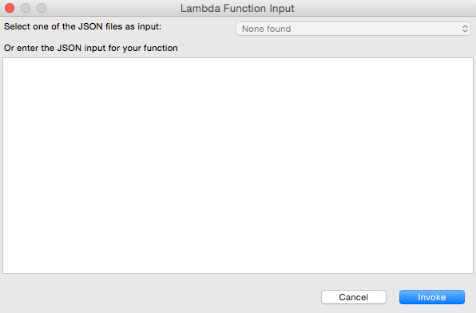

.. Copyright 2010-2016 Amazon.com, Inc. or its affiliates. All Rights Reserved.

   This work is licensed under a Creative Commons Attribution-NonCommercial-ShareAlike 4.0
   International License (the "License"). You may not use this file except in compliance with the
   License. A copy of the License is located at http://creativecommons.org/licenses/by-nc-sa/4.0/.

   This file is distributed on an "AS IS" BASIS, WITHOUT WARRANTIES OR CONDITIONS OF ANY KIND,
   either express or implied. See the License for the specific language governing permissions and
   limitations under the License.

#############################
Run |LAMlong| Function Dialog
#############################

The :guilabel:`Run Lambda Function` dialog provides a way for you to invoke a |LAM| function
directly from the Eclipse user interface.

Launching the dialog
====================

The :guilabel:`Run Lambda Function` dialog can be launched in the following ways:

*   by opening the context menu for your AWS Lambda Java Project in Eclipse's :guilabel:`Project
    Explorer` view, and selecting :guilabel:`Amazon Web Services` > :guilabel:`Run function on AWS
    Lambda...`.

*   by opening the context menu in the code window for your Java class and selecting :guilabel:`AWS
    Lambda` > :guilabel:`Run function on AWS Lambda...`.

The Invoke Function dialog appears like this:

Options
=======

There are two ways to provide data to your function. Either one or the other is required.

*   :guilabel:`Select one of the JSON files as input` |ndash| If you have any :file:`.json` files
    attached to your project, you can select one of them from the list provided. Otherwise, this
    option will be greyed out.

*   :guilabel:`Or enter the JSON input for your function` |ndash| You can directly enter valid JSON
    input for your function here. The type of data that you enter must match the input parameter of
    the Java method in your handler class.

Once you've made a selection and have provided your input data, you can click :guilabel:`Finish` to
invoke your |LAM| function, or click :guilabel:`Cancel` to exit the dialog without running anything.

