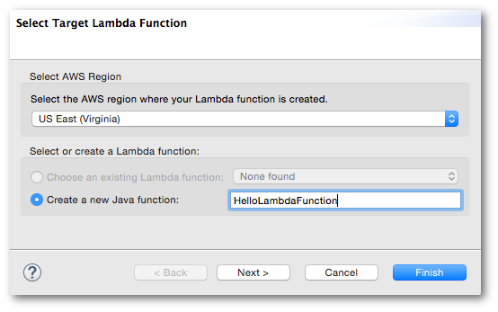
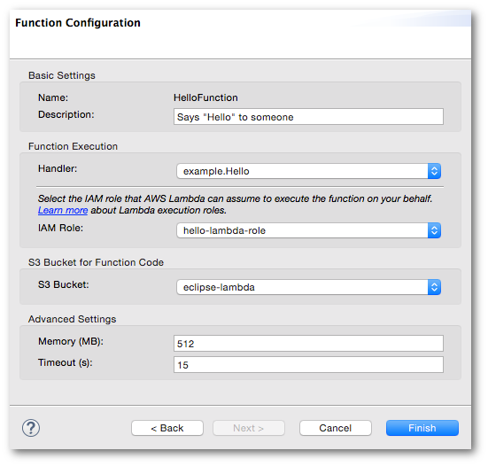

.. Copyright 2010-2016 Amazon.com, Inc. or its affiliates. All Rights Reserved.

   This work is licensed under a Creative Commons Attribution-NonCommercial-ShareAlike 4.0
   International License (the "License"). You may not use this file except in compliance with the
   License. A copy of the License is located at http://creativecommons.org/licenses/by-nc-sa/4.0/.

   This file is distributed on an "AS IS" BASIS, WITHOUT WARRANTIES OR CONDITIONS OF ANY KIND,
   either express or implied. See the License for the specific language governing permissions and
   limitations under the License.

################################
Upload |LAMlong| Function Dialog
################################

The :guilabel:`Upload Lambda Function` dialog will create a |LAM| function and upload your code to
be run when the |LAM| function is invoked.

.. contents:: **Contents**
   :depth: 1
   :local:

Launching the dialog
====================

The :guilabel:`Upload Lambda Function` dialog can be launched in the following ways:

* by opening the context menu for your AWS Lambda Java Project in Eclipse's :guilabel:`Project
  Explorer` view, and selecting :guilabel:`Amazon Web Services` > :guilabel:`Upload function to AWS
  Lambda...`.

* by opening the context menu in the code window for your Java class and selecting :guilabel:`AWS
  Lambda` > :guilabel:`Upload function to AWS Lambda...`.

The Upload Function dialog contains two screens:

* :ref:`Select Target Lambda Function <select-target-lambda-function-ui>`

* :ref:`Function Configuration <lambda-function-config-ui>`

.. _select-target-lambda-function-ui:

Select Target Lambda Function user interface
============================================

Select AWS Region
    :emphasis:`Required`. Select the region where your |LAM| function will be created.

    :emphasis:`Default`: the default |console| region for your AWS account.

Select or create a Lambda function
    :emphasis:`Required`. You must choose whether to use an existing |LAM| function from the
    drop-down list, or to create a new one by entering its name.

    :emphasis:`Default`: :guilabel:`Create a new Java function`

When you click :guilabel:`Finish`, control proceeds to the :guilabel:`Configure Function` screen.

.. _lambda-function-config-ui:

Configure Function user interface
=================================

The screen is divided into four sections, each with its own settings.

Basic Settings
--------------

This section shows the function name and allows you to add a text description.

Name
    :emphasis:`Immutable`. The name is determined by the name chosen during the :guilabel:`Select
    Target Lambda Function` screen. It can not be modified here, though you can click
    :guilabel:`Back` to re-enter it on the previous screen.

Description
    :emphasis:`Optional`. A text description of the function.

    :emphasis:`Default`: the description is empty.

Function Execution
------------------

This section allows you to modify the execution environment for the function.

Handler
    :emphasis:`Required`. The Java class that contains your |LAM| function code.

    :emphasis:`Default`: the package and class name from your project are automatically selected for
    you.

IAM Role
    :emphasis:`Required`. The role that Lambda will use to access your AWS resources during the
    execution of your function. You must make sure that this role provides access for |LAMlong| to
    at least |S3|, but if your function uses any other AWS resources, you must also provide access
    to each of the services used.

    :emphasis:`Default`: the first IAM role from your AWS account.

S3 Bucket for Function Code
---------------------------

This section allows you to set an S3 bucket used by your |LAM| function.

S3 Bucket
    :emphasis:`Required`. An |S3| bucket that can be used by your function's code. Only buckets that
    are in the same region that you will run the function in will be displayed here.

Advanced Settings
-----------------

This section contains settings that are less often used, they provide further control over your
function's execution environment than the settings in the :guilabel:`Function Execution` section.

Memory (MB)
    :emphasis:`Required`. The number of megabytes of memory available to your lambda function.

    :emphasis:`Default`: 512 MB

Timeout (s)
    :emphasis:`Required`. The timeout, in seconds, after which the function will be considered to
    have failed if it has finished execution.

    :emphasis:`Default`: 15 s.

