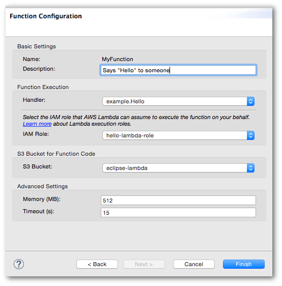

.. Copyright 2010-2016 Amazon.com, Inc. or its affiliates. All Rights Reserved.

   This work is licensed under a Creative Commons Attribution-NonCommercial-ShareAlike 4.0
   International License (the "License"). You may not use this file except in compliance with the
   License. A copy of the License is located at http://creativecommons.org/licenses/by-nc-sa/4.0/.

   This file is distributed on an "AS IS" BASIS, WITHOUT WARRANTIES OR CONDITIONS OF ANY KIND,
   either express or implied. See the License for the specific language governing permissions and
   limitations under the License.

#######################################
Upload Function to |LAMlong| Dialog Box
#######################################

You use the :guilabel:`Upload Function to AWS Lambda` dialog box to create a |LAM| function, and upload
your code to run when the |LAM| function is invoked.

Launching the Dialog Box
========================

You can launch the :guilabel:`Upload Function to AWS Lambda` dialog box in two ways:

* Open the context menu for your AWS Lambda Java Project in the Eclipse :guilabel:`Project
  Explorer` view, and then choose :guilabel:`Amazon Web Services`, :guilabel:`Upload function to AWS
  Lambda`.

* Open the context menu in the code window for your Java class, and then choose :guilabel:`AWS
  Lambda`, :guilabel:`Upload function to AWS Lambda`.

The :guilabel:`Upload Function to AWS Lambda` dialog box has two pages:

* :ref:`Select Target Lambda Function <select-target-lambda-function-ui>`

* :ref:`Function Configuration <lambda-function-config-ui>`

.. _select-target-lambda-function-ui:

Select Target Lambda Function Options
=====================================

.. image:: images/lambda_tutorial_upload_function_create_new.png
   :alt: Select Target Lambda Function page and options

Select the Handler
    (Required) The handler class that contains the |LAM| function code you want to upload.

    (Default) The most recently uploaded handler or the first one found if none were previously uploaded.

Select the AWS Region
    (Required) The region in which you want to create your |LAM| function.

    (Default) The default |console| region for your AWS account.

Select or Create a Lambda Function
    (Required) You must select whether to use an existing |LAM| function from the
    drop-down list, or to create a new one by entering its name.

    (Default) :guilabel:`Create a new Lambda function`

When you choose :guilabel:`Next`, the :guilabel:`Function Configuration` page opens.

.. _lambda-function-config-ui:

Function Configuration Options
==============================

The page is divided into five sections, each with its own settings.

Basic Settings
--------------

This section shows the function name and enables you to add a text description.

Name
    (Immutable) The name is determined by the name you chose on the :guilabel:`Select
    Target Lambda Function` page. You can't modify it here, however, you can choose
    :guilabel:`Back` to re-enter it on the previous page.

Description
    (Optional) A text description of the function.

    (Default) The description is empty.

Function Role
-------------

In this section, you can select the |IAM| role to apply to the function. You can
also create a new |IAM| role with the :guilabel:`Create` button. The |IAM| role you create
through the |tke| is a basic role that provides access to |S3|. If you need more access to |AWS| resources, you must provide access to each of the services used in the |console|.

IAM Role
    (Required) The role that |LAM| uses to access your AWS resources during the
    execution of your function.

    (Default) The first |IAM| role from your AWS account.

Function Versioning and Alias
-----------------------------

In this section, you can publish a new version of your |LAM| function and specify an alias for that
version.
To learn more about |LAM| versioning and aliasing, see
:LAM-dg:`AWS Lambda Function Versioning and Aliases <versioning-aliases>` in the
|LAM-dg|.

Publish new version
    (Default) Not selected. If you select this option, the upload creates a new version of the |LAM|
    function instead of replacing it.

Provide an alias to this new version
    (Default) Not selected. If you select this option, you can type in a new alias or use an existing
    one.

S3 Bucket for Function Code
---------------------------

In this section, you can set an |S3| bucket for your |LAM| function to use. You can
also create a new bucket with the :guilabel:`Create` button and select settings to encrypt
your |LAM| function when it uploads to |S3|.

S3 Bucket
    (Required) An |S3| bucket that your function's code can use. Only buckets
    that
    are in the same region in which you will run the function are displayed here.

    (Default) The first bucket in your list or the last bucket you uploaded your |LAM| function
    to.

Encryption setting
    (Default) None is selected. To learn more about |S3| encryption, see
    :S3-dg:`Protecting Data Using Server-Side Encryption <serv-side-encryption>`
    in the |S3-dg|.

Advanced Settings
-----------------

This section contains settings that you might use less often. They can provide you with more control over
your
function's execution environment than the settings in the :guilabel:`Function Execution` section.

Memory (MB)
    (Required) The number of megabytes of memory available to your |LAM| function.

    (Default) 512 MB.

Timeout (s)
    (Required) The timeout, in seconds, after which the function is considered to
    have failed if it has finished execution.

    (Default) 15 s.
