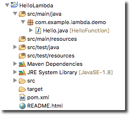

.. Copyright 2010-2016 Amazon.com, Inc. or its affiliates. All Rights Reserved.

   This work is licensed under a Creative Commons Attribution-NonCommercial-ShareAlike 4.0
   International License (the "License"). You may not use this file except in compliance with the
   License. A copy of the License is located at http://creativecommons.org/licenses/by-nc-sa/4.0/.

   This file is distributed on an "AS IS" BASIS, WITHOUT WARRANTIES OR CONDITIONS OF ANY KIND,
   either express or implied. See the License for the specific language governing permissions and
   limitations under the License.

################################################################
Tutorial: How to Create, Upload and Invoke an |LAMlong| Function
################################################################

This tutorial will guide you through the process of a typical |LAMlong| workflow and provide you
with first-hand experience in using |LAM| with the |tke|.

.. important:: The tutorial assumes that you have an AWS account, have already :doc:`installed the
   AWS Toolkit for Eclipse <getting-started>` and that you understand the basic concepts and
   features of |LAM|. If you are unfamiliar with |LAM|, you can find out more at the |LAM|_ home
   page and in the |LAM-dg|_.

.. _lambda-tutorial-create-handler-class:

Create an |LAMlong| project
============================

First, you will implement the code as a method in a handler class. The |tke| provides a new project
wizard to help you create a new handler class. The |LAM| project is a Maven project which uses a
POM.xml file for managing package dependencies. You can use the Maven command line tool for
building, testing, and deploying your application. For more information about Maven, see the
`Maven project documentation <https://maven.apache.org>`_.

.. topic:: To create an |LAMlong| project

    #.  On the Eclipse toolbar, open the drop-down Amazon Web Services menu (identified by the AWS
        icon) and select :guilabel:`New AWS Lambda Java project...` This option is also available from the
        Eclipse menu bar under *File -> New -> AWS Lambda Java Project*.

    #.  Add a *Group ID*, *Artifact ID*, and *class name* in the associated input
        boxes. The Group ID and Artifact ID refer to the IDs that identify a Maven build artifact.
        This tutorial will use the following sample values:

        * :guilabel:`Group ID`: *com.example.lambda*
        * :guilabel:`Artifact ID`: *demo*
        * :guilabel:`Class name`: *Hello*

        The :guilabel:`Package Name` field is the package namespace for the |LAMlong| handler class.
        The default value for this field is a concatination of the Group ID and the Artifact ID
        following Maven project conventions. This field is automatically updated when the
        :guilabel:`Group ID` and :guilabel:`Artifact ID` fields get updated.

    #.  For :guilabel:`Input Type`, select *Custom*. For information about each of the available
        input types, see :doc:`lambda-ref-create-project`.

    #.  Verify that your entries look like the following screenshot (modify them if they are not), and
        then click :guilabel:`Finish`.

        .. image:: images/lambda_tutorial_create_project_filled.png

        While you type, the code in the :guilabel:`Source preview` will change to reflect the
        changes you make in the dialog.

    #.  Once you click :guilabel:`Finish`, your project's directory and source files will be
        generated in your eclipse workspace, and a new web browser window will appear, displaying
        :file:`README.html` (which was created for you in your project's root directory).
        :file:`README.html` provides instructions to help guide you through the next steps of
        implementing, testing, uploading and invoking your new |LAM| function. Read through it to
        gain some familiarity with the next steps that will be covered here.

Next, we'll implement the function in the :code:`HelloLambda` Java project that was just created for
you in Eclipse.

.. _lambda-tutorial-implement-handler-method:

Implement the handler method
============================

The :guilabel:`Create New Project` dialog creates a skeleton project for you, but it's up to you to
fill in the code that will be run when your |LAM| function is invoked (in this case, by a custom
event that sends a String to your function, as you specified when setting your method's input
parameter.

.. topic:: To implement your Lambda handler method

    #.  Using Eclipse's :guilabel:`Project Explorer`, open :file:`Hello.java` in the
        :guilabel:`HelloLambda` project. It will contain code similar to the following:

        .. literalinclude:: code/HelloLambda/src/example/Hello-orig.java
            :language: java
            :lines: 16-

    #.  Replace the contents of the :code:`handleRequest` function with the following code:

        .. literalinclude:: code/HelloLambda/src/example/Hello-imp.java
            :language: java
            :lines: 16-

.. _lambda-tutorial-assume-role:

Allow |LAM| to assume an |IAM| role
===================================

In order for |LAM| to access your |LAM| function, you will need to create an |IAM| role that gives
it access to your AWS resources. You can create the role two ways, through the |console| or using the |tke|.
This section describes how to create the |IAM| role in the console. See
:ref:`lambda-tutorial-upload-code` section to create one using the |tke|.

.. topic:: To create an IAM role for Lambda

    #.  Sign in to the |console|_.

    #.  Open the :console:`IAM console <iam>`.

    #.  Select :guilabel:`Roles` on the sidebar, then :guilabel:`Create New Role`.

    #.  Add a name for your role, such as :code:`hello-lambda-role`, and click :guilabel:`Next
        Step`.

    #.  On the :guilabel:`Select Role Type` page, select :emphasis:`AWS Lambda` within the
        :guilabel:`AWS Service Roles` list.

    #.  For :guilabel:`Attach Policy`, check :emphasis:`AmazonS3FullAccess`, which allows |LAM| to
        access your |S3| resources, and then click :guilabel:`Next Step` to continue.

        .. note:: |S3| is required because |LAM| will upload your code to an |S3| bucket when you
           deploy and run your |LAM| function. You can use a bucket that you create (this is covered
           in the next section) or use an existing bucket.

    #.  Review your role parameters, then click :guilabel:`Create Role` to finish creating the |IAM|
        role.

.. _lambda-tutorial-create-bucket:

Create an |S3| bucket for your |LAM| code
=========================================

|LAMlong| requires an |S3| bucket to store your Java project when you upload it. You can either use
a bucket that already exists in the AWS region in which you'll run your code, or you can create a
new one specifically for use by |LAM| (recommended). You can create an |S3| bucket two ways,
through the |console| or using the |tke|.
This section describes how to create an |S3| bucket in the console. See
:ref:`lambda-tutorial-upload-code` section to create one using the |tke|.

.. topic:: To create an Amazon S3 bucket for use with Lambda

    #.  Log in to AWS and go to the :console:`S3 console <s3>`.

    #.  Click :guilabel:`Create Bucket`.

    #.  Enter a bucket name and select an :gloss:`AWS region <region>` for your bucket. This region
        should be the same one in which you intend to run your |LAM| function. For a list of regions
        supported by |LAM| see the :rande:`Regions and Endpoints <lambda>` topic in the |AWS-gr|.

    #.  Click :guilabel:`Create` to finish creating your bucket.

.. _lambda-tutorial-upload-code:

Upload the code
===============

Next, we'll upload your code to |LAMlong| in preparation for invoking it using the |console|.

.. topic:: To upload your function to Lambda

    #.  Right-click in your code window and select :guilabel:`AWS Lambda`, then :guilabel:`Upload
        function to AWS Lambda...`.

    #.  In the :guilabel:`Select Target Lambda Function` dialog that appears, select the AWS region to
        use. This should be the same region that you chose for your :ref:`Amazon S3 bucket
        <lambda-tutorial-create-bucket>`.

        .. image:: images/lambda_tutorial_upload_function_create_new.png

    #.  Select :guilabel:`Create a new Lambda function` and enter the name of your function (such as
        :code:`HelloFunction`).

    #.  Click :guilabel:`Next` to proceed to :guilabel:`Function Configuration`.

    #.  Enter a description for your target |LAM| function and select the |IAM| role and |S3| bucket
        that your function will use.

        .. image:: images/lambda_tutorial_upload_function_configure.png

        For more information about the available options, see :doc:`lambda-ref-upload-function`.

    #.  Click the :guilabel:`create` button in the :guilabel:`Function Role` section if you want to create
        a new |IAM| role for your |LAM| function.

        .. image:: images/lambda_tutorial_upload_create_iam_role.png

    #.  Check the :guilabel:`Publish new version` box if you want the upload to create a new version
        of the |LAM| function. To learn more about versioning and aliases in |LAM|, see the
        :LAM-dg:`AWS Lambda Function Versioning and Aliases <versioning-aliases>` in the |LAM-dg|.

    #.  If you check the box to publish a new version, the :guilabel:`Provide an alias to this new version`
        option is enabled. Check this box if you want to associated an alias to this version of the
        |LAM| function.

    #.  Click the :guilabel:`create` button in the :guilabel:`S3 Bucket for Function Code` section if
        you want to create a new bucket for your |LAM| function.

        .. image:: images/lambda_tutorial_upload_create_s3_bucket.png

    #.  You can leave the :guilabel:`Advance Settings` options as they are; the |tke|
        selects default values for you. Click :guilabel:`Finish` to upload your |LAM| function to |AWS|.

If the upload succeeds, you will see the |LAM| function name that you chose appear next to your
Java handler class in the :guilabel:`Project Explorer` view:

If you don't see this happen, you should open Eclipse's :guilabel:`Error Log` view. |LAM| will write
information about failures to upload or run your function to the error log for further debugging.

.. _lambda-tutorial-invoke-function:

Invoke the |LAM| function
=========================

You can now invoke the function on |LAMlong|.

.. topic:: To invoke your Lambda function

    #.  Right-click in your code window and select :guilabel:`AWS Lambda`, then :guilabel:`Run Function on AWS
        Lambda`.

    #.  Select the handler class you want to invoke.

    #.  In the input box, type a valid JSON string, such as "AWS Lambda".

        .. image:: images/lambda_tutorial_invoke_function.png

        .. tip:: You can add new JSON input files in your project, and they will show up in this dialog as
            long as the file name ends with ".json". You can use this feature to provide standard input
            files for your |LAM| functions.

    #.  The :guilabel:`Show Live Log` box is checked by default. This will display the logs from the |LAM|
        function output in the Eclipse console.

    #.  Click :guilabel:`Invoke` and it will send your input data to your |LAM| function. If you have
        set up everything correctly, you should see the return value of your function printed out in the
        Eclipse :guilabel:`Console` view (which will automatically appear if it isn't already shown).

        .. image:: images/lambda_tutorial_success.png

Congratulations, you've just run your first |LAM| function directly from the Eclipse IDE!

Where to go from here
=====================

Now that you've uploaded and deployed your function, try changing the code and re-running the
function. |LAM| will automatically re-upload and invoke the function for you, and print output to
the console.

For more information about each of the screens that were covered in this tutorial, as well as a full
description of each option, see the :doc:`lambda-ref`.

For more information about |LAM| itself, and about writing Java code for |LAM|, see
:lam-dg:`Authoring Lambda Functions in Java <lambda-java-how-to-create-deployment-package>` in the
|LAM-dg|.
