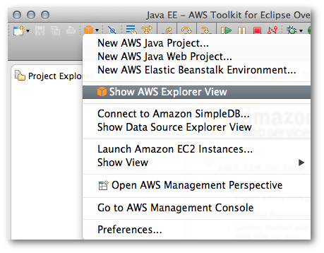
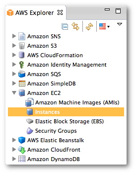

.. Copyright 2010-2016 Amazon.com, Inc. or its affiliates. All Rights Reserved.

   This work is licensed under a Creative Commons Attribution-NonCommercial-ShareAlike 4.0
   International License (the "License"). You may not use this file except in compliance with the
   License. A copy of the License is located at http://creativecommons.org/licenses/by-nc-sa/4.0/.

   This file is distributed on an "AS IS" BASIS, WITHOUT WARRANTIES OR CONDITIONS OF ANY KIND,
   either express or implied. See the License for the specific language governing permissions and
   limitations under the License.

##########################
How to Access AWS Explorer
##########################

To display |explorer|, click the AWS icon on the toolbar, and select :guilabel:`Show AWS Explorer
View`.

   AWS Icon Menu

.. note:: If the AWS icon is not visible on the toolbar, click the :guilabel:`Window` menu, and then
   click :guilabel:`Open Perspective | Other`. Click :guilabel:`AWS Management` from the list of
   Eclipse perspectives.

You can expand each node in |explorer| to view resources on AWS that are associated with your
account. For example, if you click the white triangle to the left of the :guilabel:`Amazon EC2`
node, it will expand and display |EC2| resources associated with your AWS account. The |tke| uses
the AWS account that you configured in the :doc:`tke_setup_creds` to determine which resources to
display.

If you select any of the subnodes to |EC2|, Eclipse will open a view with detailed information
about those resources. For example, double-clicking :guilabel:`Instances` opens a view that lists
information about each of your |EC2| instances such as its public DNS name, availability zone, and
launch time.

