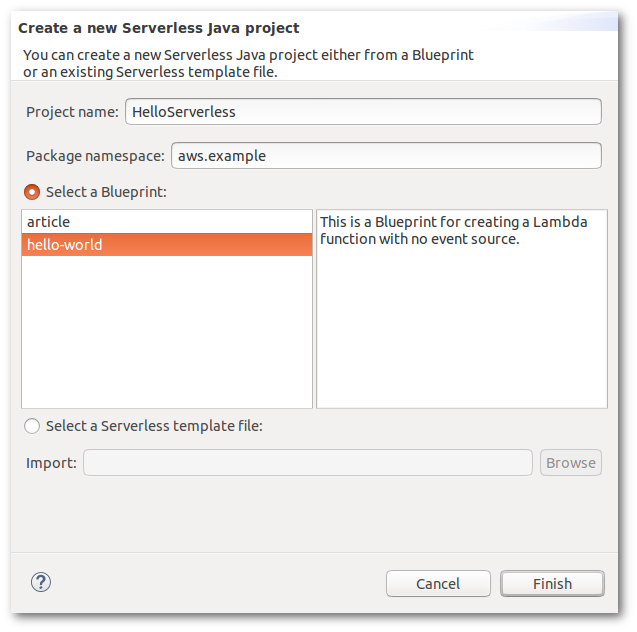
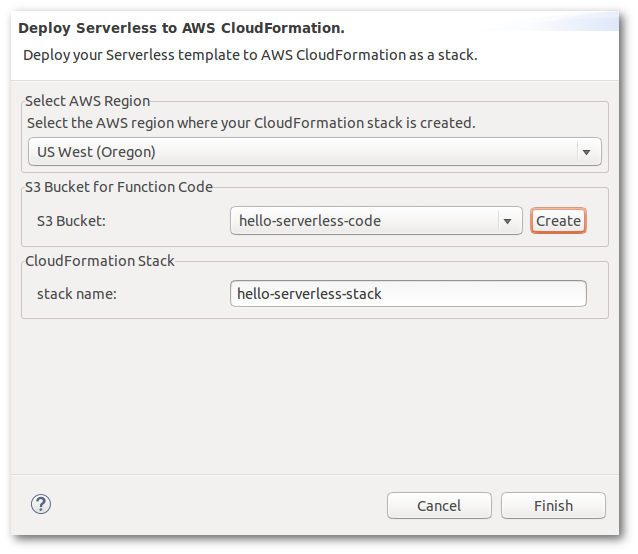

.. Copyright 2010-2016 Amazon.com, Inc. or its affiliates. All Rights Reserved.

   This work is licensed under a Creative Commons Attribution-NonCommercial-ShareAlike 4.0
   International License (the "License"). You may not use this file except in compliance with the
   License. A copy of the License is located at http://creativecommons.org/licenses/by-nc-sa/4.0/.

   This file is distributed on an "AS IS" BASIS, WITHOUT WARRANTIES OR CONDITIONS OF ANY KIND,
   either express or implied. See the License for the specific language governing permissions and
   limitations under the License.

###################
Serverless Projects
###################

.. meta::
    :description: How to create a serverless AWS project using the AWS Toolkit for Eclipse.
    :keywords: create project, serverless, lambda, cloudformation, s3, serverless application model

The |TKE| includes a project creation wizard that you can use to quickly configure and create
serverless projects that deploy on |CFN| and run |LAM| functions in response to RESTful web
requests.

Creating a Serverless Project
=============================

.. topic:: To create a serverless project

   #. Select the AWS icon in the toolbar, and choose :guilabel:`New AWS serverless project...` from
      the menu that appears.

   #. Enter a :guilabel:`Project name`.

   #. Enter a :guilabel:`Package namespace` for your project. This will be used as the prefix for
      the source namespaces created for your project.

   #. Choose either to :guilabel:`Select a blueprint` or to :guilabel:`Select a serverless template
      file`:

      Select a Blueprint
          Choose a :ref:`pre-defined project blueprint <serverless-blueprints>` to use for your
          serverless project.

      Select a Serverless Template File
          Choose a JSON-formatted Serverless Application Model (SAM) :file:`.template` file on your
          filesystem to fully customize your serverless project.

      .. note:: For information about the structure and contents of a :file:`.template` file, view
         the :github:`current version of the specification
         <awslabs/serverless-application-model/blob/master/versions/2016-10-31.md>` on GitHub.

   #. Press the :guilabel:`Finish` button to create your new serverless project.

   The serverless project wizard

.. _serverless-blueprints:

Serverless Project Blueprints
=============================

The following serverless project blueprints are available to use:

article
    This blueprint creates a S3 Bucket for storing article content, and a DynamoDB Table for article
    metadata.  It contains |LAM| functions for retrieving (:methodname:`GetArticle`) and storing
    (:methodname:`PutArticle`) articles, which are triggered by API Gateway events.

hello-world
    A simple blueprint that creates a |LAM| function which takes a single string. Its output is
    :samp:`Hello, {value}`, where *value* is the string that was passed in, or ``World`` if no
    string is passed to the function.

.. _serverless-structure:

Serverless Project Structure
============================

The serverless project wizard will create a new Eclipse project for you, consisting of the following
parts:

* The :file:`src` directory contains two sub-directories, each prefaced with your chosen
  :guilabel:`Package namespace`:

  mynamespace.function
      Contains class files for the |LAM| functions that are defined by your serverless template.

  mynamespace.model
      Contains generic :classname:`ServerlessInput` and :classname:`ServerlessOutput` classes that
      define the input and output model for your |LAM| functions.

      .. tip:: For more information about the input and output formats used in the model classes,
         see the :ABP-dg:`Configure Proxy Integration for a Proxy Resource
         <api-gateway-set-up-simple-proxy>` page in the |ABP-dg|.

* The :file:`serverless.template` file defines the AWS resources and |LAM| functions (a resource of
  type "AWS::Serverless:Function") used by your project.

.. _serverless-deploy:

Deploying a Serverless Project
==============================

.. topic:: To deploy your serverless project

   #. In Eclipse's :guilabel:`Project Explorer` window, select your project and open the context
      menu (right-click or long press).

   #. Choose :menuselection:`Amazon Web Services --> Deploy Serverless Project...` on the context
      menu. This will bring up the :guilabel:`Deploy Serverless to AWS CloudFormation` dialog.

   #. Select the :guilabel:`AWS Regions` to use. This determines where the |CFN| stack that you
      deploy is located.

   #. Choose an :guilabel:`S3 Bucket` to use to store your |LAM| function code, or select the
      :guilabel:`Create` button to create a new S3 bucket to store your code.

   #. Choose a name for your |CFN| stack.

   #. Press the :guilabel:`Finish` button to upload your |LAM| functions to |S3| and deploy your
      project template to |CFN|.

   The serverless project deployment dialog

When your project is deployed, a |CFN| stack detail window will appear that provides information
about your deployment and its current status. It will initially show its status as
``CREATE_IN_PROGRESS``. When the status is ``CREATE_COMPLETE``, your deployment is active.

To return to this window at any time, open the :guilabel:`AWS Explorer`, select the :guilabel:`AWS
CloudFormation` node, and then select the name of the |CFN| stack you specified.

.. note:: If there was an error during deployment, your stack may be rolled back. See
   :cfn-ug:`Troubleshooting <troubleshooting>` in the |CFN-ug| for information about how to diagnose
   stack deployment errors.

See Also
========

* :github:`AWS Serverless Application Model (GitHub) <awslabs/serverless-application-model>`
* :doc:`tke-cfn-editor`
* :doc:`lambda`

