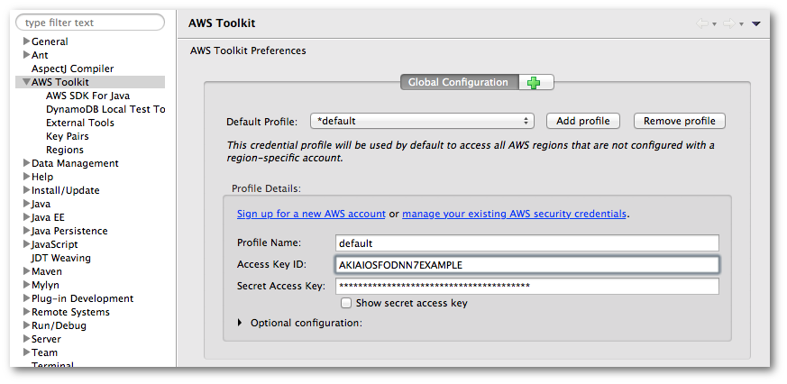
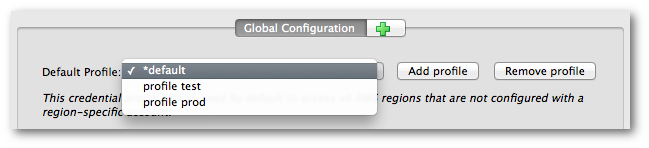

.. Copyright 2010-2016 Amazon.com, Inc. or its affiliates. All Rights Reserved.

   This work is licensed under a Creative Commons Attribution-NonCommercial-ShareAlike 4.0
   International License (the "License"). You may not use this file except in compliance with the
   License. A copy of the License is located at http://creativecommons.org/licenses/by-nc-sa/4.0/.

   This file is distributed on an "AS IS" BASIS, WITHOUT WARRANTIES OR CONDITIONS OF ANY KIND,
   either express or implied. See the License for the specific language governing permissions and
   limitations under the License.

######################
Set up AWS Credentials
######################

To access |AWSlong| with the |tke|, you must configure the |tke| with AWS account credentials.

Get your AWS access keys
========================

.. include:: common/procedure-get-access-keys.txt

.. _add-access-keys:

Add your AWS access keys to the |tke|
=====================================

The |tke| uses the same system for locating and using AWS access keys as that used by the AWS CLI
and AWS Java SDK. Access keys entered in the Eclipse IDE are saved to a :emphasis:`shared AWS
credentials file` (called :file:`credentials`) in the :file:`.aws` sub-directory within your home
directory.

.. note:: The location of the credential file can be modified. For information about setting the
   location of this file, see :ref:`set_credfile_location`.

If you have already set your AWS credentials using the AWS CLI, then the |tke| will automatically
detect and use those credentials. For more information about using the AWS CLI, see the |cli-ug|_.

.. topic:: To add your access keys to the AWS Toolkit for Eclipse

    #. Open Eclipse's :guilabel:`Preferences` dialog box and click :guilabel:`AWS Toolkit` in the
       sidebar.

    #. Type or paste your AWS access key ID in the :guilabel:`Access Key ID` box.

    #. Type or paste your AWS secret access key in the :guilabel:`Secret Access Key` box.

    #. Click :guilabel:`Apply` or :guilabel:`OK` to store your access key information.

Here's an example of a configured set of default credentials:

.. _using_profiles:

Using multiple AWS accounts with the |tke|
==========================================

The :guilabel:`Preferences` dialog box allows you to add information for more than one AWS account.
Multiple accounts can be useful, for example, to provide developers and administrators with separate
resources for development and for release/publication.

Separate sets of AWS credentials are stored as :emphasis:`profiles` within the shared AWS
credentials file described in :ref:`add-access-keys`. All of the configured profiles can be seen in
the drop-down box at the top of the AWS Toolkit Preferences Global Configuration screen, labeled
:guilabel:`Default Profile`.

.. topic:: To add a new set of access keys

    #. On the :guilabel:`AWS Toolkit Preferences` screen in Eclipse's :guilabel:`Preferences` dialog
       box, click :guilabel:`Add profile`.

    #. Add your new account information to the :guilabel:`Profile Details` section.

       Choose a descriptive name for the :guilabel:`Profile Name`, and enter your access key
       information in the :guilabel:`Access Key ID` and :guilabel:`Secret Access Key` boxes.

    #. Click :guilabel:`Apply` or :guilabel:`OK` to store your access key information.

You can repeat this procedure for as many sets of AWS account information that you need.

When you have entered all of your AWS account information, select the default account by choosing
one of the accounts from the :guilabel:`Default Profile` drop-down. AWS Explorer displays resources
associated with the default account, and when you create a new application through the |tke|, the
application uses the credentials for the configured default account.

.. note:: For an alternative approach to separate your AWS resources, see
   :doc:`differentiate-resources-with-naming`.

.. _set_credfile_location:

Changing the AWS credentials file location
==========================================

Using the |tke| Preferences screen, you can change the location used by the Toolkit to store and
load credentials.

.. topic:: To set the AWS credentials file location

    * In the AWS Toolkit Preferences dialog, locate the :guilabel:`Credentials file location`
      section, and enter the pathname of the file where you would like your AWS credentials stored.

    .. image:: images/tke-pref-set-credfile-loc.png

.. important:: It is :emphasis:`strongly recommended` that you don't store your AWS credential
   information within any network-shared directory or within any source-control-managed projects.
   Always retain strict control of your AWS access keys!

