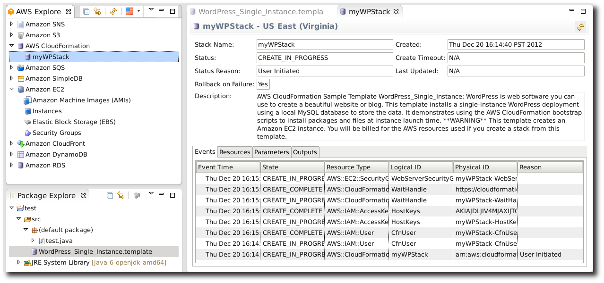

.. Copyright 2010-2016 Amazon.com, Inc. or its affiliates. All Rights Reserved.

   This work is licensed under a Creative Commons Attribution-NonCommercial-ShareAlike 4.0
   International License (the "License"). You may not use this file except in compliance with the
   License. A copy of the License is located at http://creativecommons.org/licenses/by-nc-sa/4.0/.

   This file is distributed on an "AS IS" BASIS, WITHOUT WARRANTIES OR CONDITIONS OF ANY KIND,
   either express or implied. See the License for the specific language governing permissions and
   limitations under the License.

#####################################
Updating an |CFN| Template in Eclipse
#####################################

**To update an CloudFormation template from Eclipse**

1.  With your |CFN| :code:`.template` file open in the |CFN| template editor (see
    :doc:`tke-cfn-editor-adding-template` for more information), right-click on the open template
    and select :guilabel:`Run on AWS`, then :guilabel:`Update Stack` on the context menu.

    .. image:: images/tke-cfn-editor-update-stack.png
        :scale: 50%

2.  In the :guilabel:`Update CloudFormation Stack` dialog, select your stack name in the
    :guilabel:`Stack Name` field if it has not been automatically selected for you. Your template
    file should also be automatically chosen in the :guilabel:`Template File` field.

    .. image:: images/tke-cfn-editor-update-stack-dlg.png
        :scale: 50%

3.  Choose any (or none) of the following options:

    .. include:: tke-cfn-launch-options.txt

4.  Click :guilabel:`Next` to continue with entering parameter values.

5.  If your stack has parameters, you will enter values for them next. For parameters with a
    predefined list of possible responses, you can choose a value from the list provided.

    .. image:: images/tke-cfn-editor-update-stack-dlg-params.png
        :scale: 50%

6.  Click :guilabel:`Finish` to begin updating your stack.

While your stack is being updated, you can view its status by double-clicking the stack name beneath
the :guilabel:`CloudFormation` node in the :guilabel:`AWS Explorer` view, or by right-clicking the
stack name and selecting :guilabel:`Open in Stack Editor` on the context menu.

