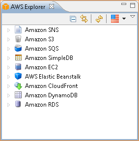
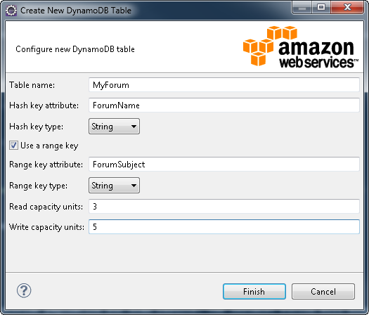
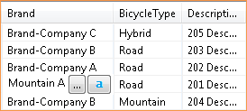
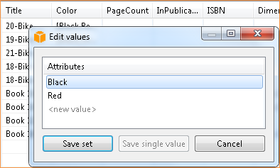
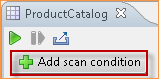
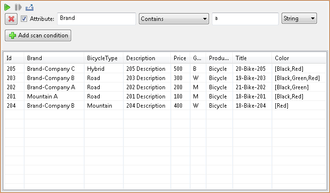

.. Copyright 2010-2016 Amazon.com, Inc. or its affiliates. All Rights Reserved.

   This work is licensed under a Creative Commons Attribution-NonCommercial-ShareAlike 4.0
   International License (the "License"). You may not use this file except in compliance with the
   License. A copy of the License is located at http://creativecommons.org/licenses/by-nc-sa/4.0/.

   This file is distributed on an "AS IS" BASIS, WITHOUT WARRANTIES OR CONDITIONS OF ANY KIND,
   either express or implied. See the License for the specific language governing permissions and
   limitations under the License.

#############################
Using |DDB| with AWS Explorer
#############################

|DDBlong| is a fast, highly scalable, highly available, cost-effective, non-relational database
service. |DDB| removes traditional scalability limitations on data storage while maintaining low
latency and predictable performance. The |tke| provides functionality for working with |DDB| in a
development context. For more information, see |DDB|_ on the AWS website.

In the |tke|, AWS Explorer displays all the |DDB| tables associated with the active AWS account.

   Display Amazon DynamoDB tables in AWS Explorer.

.. _tkv-dynamodb-create-table:

Creating an |DDB| Table
=======================

Using the |tke|, you can create a new |DDB| table.

**To create a new table in AWS Explorer**

1.  In :guilabel:`AWS Explorer`, right-click :guilabel:`Amazon DynamoDB`, and then click
    :guilabel:`Create Table`. The :guilabel:`Create New DynamoDB Table` wizard appears.

2.  Enter a table name in the :guilabel:`Table name` box.

3.  Enter a primary hash key attribute in the :guilabel:`Hash key attribute` box, and select the
    hash key type from the :guilabel:`Hash key type` drop-down list. |DDB| builds an unordered hash
    index using the primary key attribute and an optional sorted range index using the range primary
    key attribute. For more information about the primary hash key attribute, see :ddb-dg:`Primary
    Key <DataModel>` in the |DDB-dg|.

4.  Optionally, specify a range primary key by selecting :guilabel:`Use a range key`. Enter a range
    key attribute in the :guilabel:`Range key attribute` box, and select a range key type from the
    :guilabel:`Range key type` drop-down list.

5.  Specify the number of read capacity units in the :guilabel:`Read capacity units` box, and
    specify the number of write capacity units in the :guilabel:`Write capacity units` box. You must
    specify a minimum of 3 read capacity units and 5 write capacity units. For more information
    about read and write capacity units, see :ddb-dg:`Provisioned Throughput in Amazon DynamoDB
    <ProvisionedThroughputIntro>` in the |DDB-dg|.

6.  Click :guilabel:`Finish` to create the table. Click the refresh button in :guilabel:`AWS
    Explorer` to view your new table in the table list.

   Creating a table

.. _tke-dynamodb-grid-view:

Viewing an |DDB| Table as a Grid
====================================

To open a grid view of one of your |DDB| tables, double-click the subnode in :guilabel:`AWS
Explorer` that corresponds to the table. From the grid view, you can view the items, attributes, and
values stored in the table. Each row corresponds to an item in the table. The table columns
correspond to attributes. Each cell of the table holds the values associated with that attribute for
that item.

An attribute can have a value that is a string or a number. Some attributes have a value that
consists of a :emphasis:`set` of strings or numbers. Set values are displayed as a comma-separated
list enclosed by square brackets.

.. figure:: images/dynamodb-product-catalog.png

    Amazon DynamoDB Grid View

.. _tke-dynamodb-editing:

Editing Attributes and Values
=============================

The table grid view is :emphasis:`editable`; by double-clicking a cell, you can edit the values for
the item's corresponding attribute. For set-value attributes, you can also add or delete individual
values from the set.

    Cell editing in Amazon DynamoDB Grid View

The editing UI enables you not only to change the value of an attribute, but also to change the
format of the value for the attribute |mdash| with some limitations. For example, any number value
can be converted into a string value. If you have a string value, the content of which is a number,
such as "125", the editing UI enables you to convert the format of the value from string to number.
Also, the editing UI enables you to convert a single-value to a set-value. However, you cannot
generally convert from a set-value to a single-value; an exception is when the set-value has, in
fact, only one element in the set.

    Editing set values in Amazon DynamoDB Grid View

The :guilabel:`Edit Values` dialog box opens when you are editing a set of values. After editing the
attribute value, click :guilabel:`Save set` to confirm your changes. If you want to discard your
changes, click :guilabel:`Cancel`.

After confirming your changes, the attribute value is displayed in red. This indicates that the
attribute has been updated, but that the new value has not been written back to the Amazon |DDB|
database. To write your changes back to |DDB|, click :guilabel:`File`, and then click
:guilabel:`Save`, or press from the keyboard. To discard your changes, click :guilabel:`Scan Table`,
and when the Toolkit asks if you would like to commit your changes before the Scan, click
:guilabel:`No`.

.. _tke-dynamodb-scan:

Scanning an |DDB| Table
===========================

    Scan button

From the Toolkit, you can perform Scans on your |DDB| tables. In a Scan, you define a set of
criteria and the Scan returns all items from the table that match your criteria. Scans are expensive
operations and should be used with care to avoid disrupting higher-priority production traffic on
the table. For more recommendations on safely using the Scan operation, go to the :title:`Amazon
DynamoDB Developer Guide`.

**To perform a Scan on an Amazon DynamoDB table from AWS Explorer**

1.  In the grid view, click :guilabel:`Add scan condition`. A UI appears that enables you to edit a
    new Scan clause.

2.  In the Scan clause editor, specify the attribute to match against, how it should be matched
    (Begins With, Contains, etc.), what literal value it should match, and if the value is a string
    or a number.

3.  Add more Scan clauses as needed for your search. The Scan will return only those items that
    match the criteria from all of your Scan clauses. Note that the Scan will perform a
    case-sensitive comparison when matching against string values.

4.  On the button bar at the top of the grid view, click the green play button to run the scan.

To remove a Scan clause, click the red X to the left of each clause.

    Scan button

To return to the view of the table that includes all items, double-click :guilabel:`Amazon DynamoDB`
in :guilabel:`AWS Explorer`.

:emphasis:`Paginating Scan Results`

At the top of the view are three buttons.

    Paginate and export buttons

The *second* button provides pagination for Scan results. Clicking the *rightmost* button exports
the results from the current scan into a CSV file.

