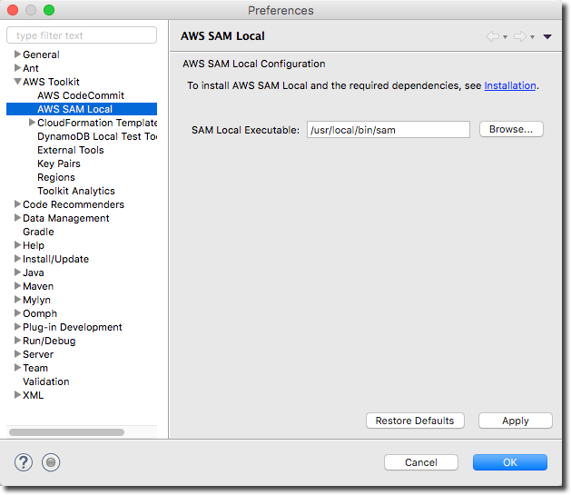
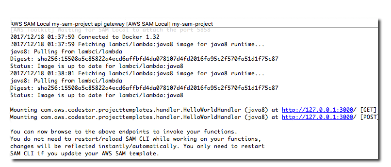
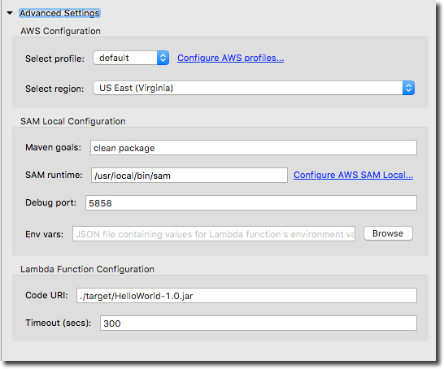

.. Copyright 2010-2017 Amazon.com, Inc. or its affiliates. All Rights Reserved.

   This work is licensed under a Creative Commons Attribution-NonCommercial-ShareAlike 4.0
   International License (the "License"). You may not use this file except in compliance with the
   License. A copy of the License is located at http://creativecommons.org/licenses/by-nc-sa/4.0/.

   This file is distributed on an "AS IS" BASIS, WITHOUT WARRANTIES OR CONDITIONS OF ANY KIND,
   either express or implied. See the License for the specific language governing permissions and
   limitations under the License.

#################################################
Debug Serverless Applications Using AWS SAM Local
#################################################

.. meta::
    :description: How to use the SAM local feature of the AWS Eclipse Toolkit to debug
                  lambda functions and API gateway setup
    :keywords: serverless application model, lambda, API gateway, debugging, SAM local

This tutorial guides you through debugging a serverless application project with the |tke|
using SAM local. SAM local is the AWS CLI tool for managing serverless applications written
with the AWS Serverless Application Model (SAM). See the SAM local
:github:`README <awslabs/aws-sam-local>` for more information.

Prerequisites
=============

To use this tutorial you must have the |tke|, Docker and AWS SAM Local installed.
See the AWS SAM Local :github:`README <awslabs/aws-sam-local#installation>` for Docker and
SAM Local installation instructions. See the :doc:`Getting Started <getting-started>`
topic for instructions on installing and setting up the |tke|.

After the required tools are installed, open Eclipse's :guilabel:`Preferences` dialogue
from the :guilabel:`Eclipse` menu. Configure the SAM Local Executable path, as shown.
This enables the AWS Toolkit for Eclipse to know where to find your SAM Local installation.

Import SAM Application from |ACSlong|
=====================================

For this tutorial you will need a sample project in |ACSlong|. See the
`Creating a Serverless Project in AWS CodeStar <http://docs.aws.amazon.com/codestar/latest/userguide/sam-tutorial.html#sam-tutorial-create-project>`_
tutorial in the |ACS-ug| to create a sample project.

.. topic:: Import SAM app from |ACSlong|

    #.  On the Eclipse toolbar, open the Amazon Web Services menu (identified by the AWS
        homepage icon), and then choose :guilabel:`Import AWS CodeStar Project`. Or on the
        Eclipse menu bar, choose :guilabel:`File`, :guilabel:`Import`,
        :guilabel:`AWS`, :guilabel:`AWS CodeStar Project`.

    #.  Choose the region that the sample application was created in.

    #.  Choose your sample project from the :guilabel:`Project Name` list.

    #.  Add in your Git credentials. See the :ACC-ug:`AWS CodeCommit user guide <setting-up-gc>`
        to learn how to get Git credentials for |ACC|.

        .. image:: images/sam-local-codestar-import.png
           :alt: Sam local import codestar project dialogue box

    #.  Choose :guilabel:`Next`.

    #.  Choose :guilabel:`Next` on the :guilabel:`Branch Selection` page.

    #.  Choose :guilabel:`Finish` on the :guilabel:`Local Destination` page.

Next, you can debug this serverless application locally using SAM Local within Eclipse.

Debug |LAM| Function Locally
============================

Create a debug configuration for your serverless application and use SAM Local
to run the application locally.

.. topic:: Debug lambda function locally

    #.  In the Eclipse :guilabel:`Project Explorer`, open :file:`HelloWorldHandler.java`.

    #.  Right-click in your Eclipse code window, choose :guilabel:`Debug As`, then choose
        :guilabel:`AWS SAM Local`.

        .. image:: images/sam-local-debug-config.png
           :alt: Sam local debug dialog box

    #.  For this example, we will provide an |S3| event. Choose the :guilabel:`Generate`
        button next to the :guilabel:`Event` input box.

        .. image:: images/sam-local-debug-config-event.png
           :alt: Sam local debug dialog box

    #.  Choose a region that has your |S3| bucket.

    #.  Enter a valid |S3| bucket name.

    #.  Enter a valid |S3| object key, then choose :guilabel:`OK`.

    #.  In the :guilabel:`Save As` page, select the current project and enter a name for the event file.

        .. image:: images/sam-local-debug-config-event-file.png
           :alt: Sam local debug dialog box

    #.  Choose :guilabel:`OK` to save the event file and get back to the main dialog.

    #.  You can leave the advanced settings as is. See the :ref:`Advanced Settings <sam-local-advanced-settings>`
        section to learn more about those fields.

    #.  Choose :guilabel:`Apply` and then :guilabel:`Debug`.

This runs the |LAM| function locally. You can set breakpoints as you would for other applications to
debug the code.

Test |ABP| Locally
==================

You can also test the HTTP request/response functionality with SAM Local.

.. topic:: Test API Gateway locally

    #.  Right-click in your Eclipse code window, choose :guilabel:`Debug As` >
        :guilabel:`Debug Configuration`.

        .. image:: images/sam-local-debug-config-api.png
           :alt: Sam local debug dialog box

    #.  Create a new Debug Configuration for this run and name it something different.

    #.  Choose :guilabel:`API Gateway` from the :guilabel:`Run As` field.

    #.  Leaving all other fields as is, your configuration should look similar to this.

        .. image:: images/sam-local-debug-config-api-2.png
           :alt: Sam local debug dialog box

    #.  Choose :guilabel:`Apply` and then :guilabel:`Debug`.

This spawns a local API gateway that you can use to test your application.
The debug output will contain HTTP links that can be used to verify the request/response
functionality of your code.

.. _sam-local-advanced-settings:

Advanced Settings
=================

This section describes the advanced options available in the SAM Local Debug
configurations page.

*  AWS Configuration

   Select profile
      (Required) The profile to use for AWS credentials.

      (Default) The default profile.

   Select region
      (Required) The region that the application is deployed to.

      (Default) US East (Virginia).

*  SAM Local Configuration

   Maven goals
      (Required) Maven goals to execute when building the application.

      (Default) clean package.

   SAM runtime
      (Required) Path to the SAM executable.

      (Default) /usr/local/bin/sam.

   Debug port
      (Required) Port that the Eclipse debugger uses to connect to SAM Local.

      (Default) 5858

   Env vars
      (Optional) Path to a json file that contains values for environment
      variables used by |LAM| functions. See `Environment variable files
      <https://github.com/awslabs/aws-sam-local#environment-variable-file>`_ in the
      SAM Local user guide to learn the required syntax for this file.

      (Default) Empty

*  Lambda Function Configuration

   Code URI
      (Optional) Path to the code archive file. For the example on this page, it
      would be the path to the jar file.

      (Default) Path in the template.yml file.

   Timeout
      (Required) |LAM| function runtime timeout

      (Default) 300

More Info
=========

For more information about AWS SAM Local, see the
:github:`AWS SAM Local <awslabs/aws-sam-local>` user guide in GitHub. For more information
about the AWS Serverless Application Model (SAM), see the
:github:`AWS SAM <awslabs/serverless-application-model>` project in GitHub.
